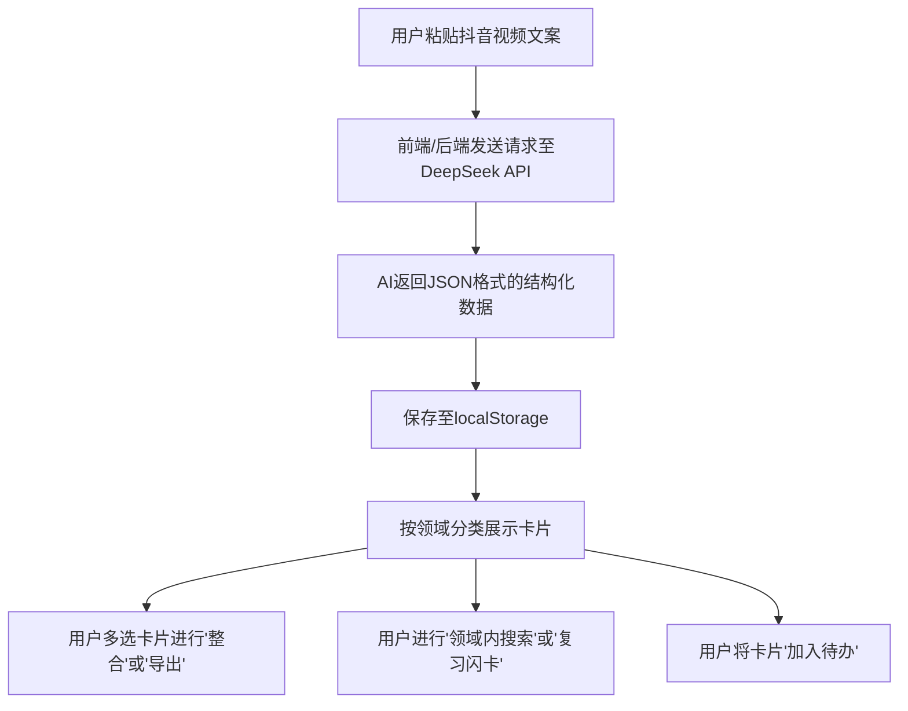

## 1. 产品概述
抖音知识卡片（知卡/视记/刷得值）旨在将用户在抖音收藏的有价值视频内容转化为可复用的个人知识资产。解决用户刷视频后遗忘、找不到、缺乏整合的痛点，核心理念是"让每一条视频都变成你的知识"。

## 2. 核心功能

### 2.1 用户角色
| 角色 | 注册方式 | 核心权限 |
|------|----------|----------|
| 普通用户 | 本地使用，无账号 | 粘贴文案生成卡片、分类查看、搜索、整合卡片、待办管理、复习闪卡、导出图片 |

### 2.2 功能模块
1. **主页/工作区**：包含顶部操作区（生成、整合、复习）、分类标签栏、卡片瀑布流/网格展示。
2. **卡片详情/交互**：卡片详情弹窗展示、闪卡翻转复习、卡片选中与多选操作。
3. **设置/配置**：DeepSeek API Key 配置（可选，若通过前端直接调用或作为环境变量）。

### 2.3 页面详情
| 页面名称 | 模块名称 | 功能描述 |
|----------|----------|----------|
| 主工作台 | 输入区 | 接收用户粘贴的视频文案，调用AI生成知识卡片 |
| 主工作台 | 分类导航栏 | 展示"全部"及七大领域标签（生活/职场/学习/娱乐/财经/健康/科技）和"待办"特殊分类，支持点击筛选 |
| 主工作台 | 搜索区 | 支持全局搜索及**领域内搜索**，匹配标题、核心观点和要点 |
| 主工作台 | 卡片展示区 | 展示卡片缩略信息，支持多选，提供"整合卡片"和"导出图片"入口 |
| 弹窗/模态框 | 卡片详情 | 展示完整字段内容及原视频链接，包含"加入待办"按钮 |
| 弹窗/模态框 | 复习闪卡 | 正反面翻转展示，支持"记住了"和"没记住"状态标记 |

## 3. 核心流程
用户复制视频文案 -> 粘贴到应用 -> 调用大模型生成结构化卡片 -> 存入本地并分类展示 -> 用户可进行搜索、整合、复习、加入待办等操作。

## 4. 用户界面设计

### 4.1 设计风格
- **主色调**：知识工具感（蓝白灰配色），主色为科技蓝（#2563EB）或清新蓝，背景为极简浅灰（#F8FAFC）。
- **按钮样式**：圆角矩形（border-radius: 8px），微小阴影，悬浮时有轻微的放大或颜色加深反馈。
- **字体**：现代无衬线字体（如 PingFang SC, Inter, system-ui），保证阅读清晰度。
- **布局风格**：卡片式布局（Card UI），网格排列（Grid/Masonry），元素间有舒适的间距（Gap: 20px）。
- **动效**：卡片生成时的加载动画、闪卡翻转的3D旋转动效、弹窗的平滑淡入淡出。

### 4.2 页面设计概览
| 页面名称 | 模块名称 | UI元素 |
|----------|----------|--------|
| 主工作台 | 顶部操作栏 | Logo、Slogan、文案输入框、"生成卡片"按钮、"复习模式"按钮 |
| 主工作台 | 过滤器/分类 | 胶囊状分类标签（选中状态高亮）、带有当前搜索范围提示的搜索框 |
| 主工作台 | 卡片流 | 白色背景卡片、左上角复选框、领域标签Tag、标题、核心观点摘要 |
| 整合结果 | 汇总卡片 | 带有特殊"整合"角标或异形背景的突出卡片 |

### 4.3 响应式设计
- 优先适配桌面端宽屏体验，方便多卡片并排对比。
- 移动端适配：卡片单列显示，弹窗全屏化，导航栏支持横向滑动。
