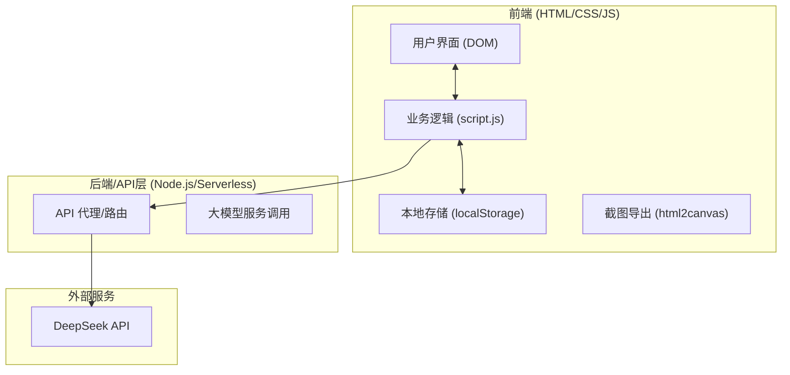
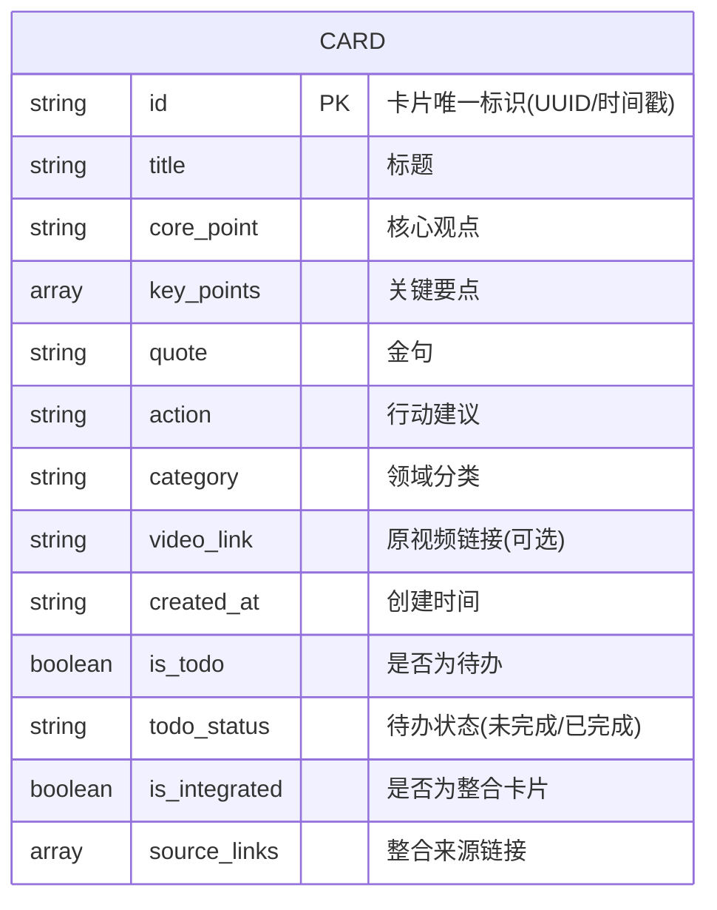

## 1. 架构设计


## 2. 技术说明
- **前端栈**：纯前端 HTML5 + CSS3 + 原生 JavaScript (ES6+)。符合黑客松队伍分工要求。
- **UI框架/库**：不使用大型框架，仅使用 `html2canvas` 库用于一键导出图片功能，图标使用 `iconfont` 或 `Lucide Icons`。
- **后端/API**：考虑到 CORS 跨域问题和 API Key 的安全性，引入一个轻量级的 Node.js (Express) 服务器作为后端代理，用于安全调用 DeepSeek API。
- **数据持久化**：使用浏览器 `localStorage`，以 JSON 格式存储卡片数组。

## 3. 路由定义 (后端API)
| 路由 | 方法 | 用途 |
|------|------|------|
| `/api/generate` | POST | 接收视频文案，调用DeepSeek API生成单张知识卡片 |
| `/api/integrate` | POST | 接收多张卡片内容，调用DeepSeek API生成汇总整合卡片 |

## 4. API 定义
### 4.1 生成卡片请求 (POST `/api/generate`)
```typescript
interface GenerateRequest {
  text: string; // 抖音视频文案
}
interface GenerateResponse {
  title: string; // 10字以内
  core_point: string; // 一句话核心观点
  key_points: string[]; // 3个关键要点
  quote: string; // 金句
  action: string; // 行动建议
  category: '生活' | '职场' | '学习' | '娱乐' | '财经' | '健康' | '科技';
}
```

### 4.2 整合卡片请求 (POST `/api/integrate`)
```typescript
interface IntegrateRequest {
  cardsContent: string; // 拼接后的选中卡片内容
}
interface IntegrateResponse {
  title: string; // 汇总标题
  summary: string; // 综合观点（50字以内）
  angles: string[]; // 角度分析
  conclusion: string; // 关键结论（30字以内）
}
```

## 5. 数据模型
### 5.1 数据模型定义 (localStorage 结构)

